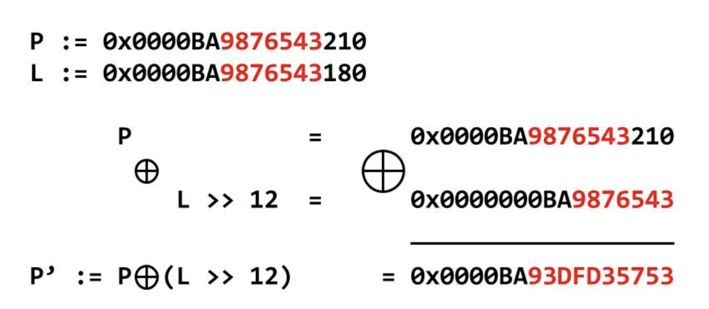

# Memory Tagging Extensions

## Overview

Much like with [Pointer Authentication](pointer-authentication.md), Arm consistently comes out with hardware-enabled protections that provide greater security. MTE, as it is called, is a hardware-based defence against memory safety vulnerabilities.

There are two common mistakes in memory management that commonly cause vulnerabilities:

<table><thead><tr><th width="163">Vulnerability Type</th><th width="248">Examples</th><th>Description</th></tr></thead><tbody><tr><td>Spatial Safety</td><td>OOB access, Buffer Overflow</td><td>Program accesses memory outside of the allocated region</td></tr><tr><td>Temporal Safety</td><td><a href="../../types/heap/use-after-free.md">UAF</a>, <a href="../../types/heap/double-free/">Double-Free</a></td><td>Program accesses memory after it has freed it</td></tr></tbody></table>

MTE aims to mitigate both of these vulnerabilities using a "lock" and "key" system.

## Operation: Tagging

Within the lock and key system, there are two types of tagging:

* **Address Tagging** (the key) - adds a four-bit "tag" to the top of every pointer used in the program; this only works in 64-bit applications since it uses "top-byte-ignore", an Arm 64-bit feature
* **Memory Tagging** (the lock) - also consists of four bits, linked to every 16-byte aligned region in the applications memory space (these regions are referred to as **tag granules**)

The idea is that, through **address tagging**, a **pointer** can only access a region of **memory** if the **memory tag** matches the **address tag**. Let's take some [slides](https://docs.google.com/presentation/d/10V_msbtEap9dNerKvTrRAzvfzYdrQFC8e2NYHCZYJDE/edit?usp=sharing) from [this talk](https://www.youtube.com/watch?v=9wRT2hNwbkA):

<figure><figcaption></figcaption></figure>

The pointer `p` is "tagged" with the green tag, but is attempting to access memory that is tagged purple. The processor notes that the tag of the pointer is different to that of the purple tag, and throws an error.

<figure><figcaption></figcaption></figure>

On initial allocation via `malloc`, `2N` bytes of space is tagged green, and the pointer is tagged green. Then, when the green pointer is freed, the green memory is retagged to red. If the green pointer is then used again, the processor will notice a difference in tag and throw an error.

## How is MTE used?

There are [three modes of MTE](https://source.android.com/docs/security/test/memory-safety/arm-mte): [**Synchronous**](https://source.android.com/docs/security/test/memory-safety/arm-mte#sync-mode), [**Asynchronous**](https://source.android.com/docs/security/test/memory-safety/arm-mte#async-mode) and [**Asymmetric**](https://source.android.com/docs/security/test/memory-safety/arm-mte#asymmetric-mode).

* Synchronous mode is optimized for correctness of bug detection and has the highest overhead; on a tag mismatch, the process terminates with SIGSEGV immediately
* Asynchronous is optimized for performance; on a tag mismatch, the process continues execution until the nearest kernel entry, and then terminates with SIGSEGV
* Asymmetric is an improvement on Asynchronous in pretty much every way, doing synchronous checking on **reads** and asynchronous on **writes**

Android suggests using SYNC mode for testing to catch bugs, and use ASYMM in production (or ASYNC if ASYMM does not exist in the processor) due to the lowr overhead.

While MTE is incredibly powerful, it is sometimes **too** powerful, and as a result it is not always enabled by default. Many apps with buggy invalid accesses work perfectly fine silently, but will cause a full crash if MTE is enabled. As a result MTE is not forced upon user-installed apps on either Android or iOS. Due to performance concerns, MTE is not enabled by default for the Android kernel either.


Apple now uses a new security mitigation called [Memory Integrity Enforcement](memory-integrity-enforcement.md) in their very latest iPhones, and we can expect to see this in the new Apple Silicon chips too.


## Enhanced MTE

This is a set of modifications made to MTE [thanks to Apple](https://security.apple.com/blog/memory-integrity-enforcement/), through collaboration with Arm. I can find little information about it except [here](https://developer.arm.com/documentation/109697/0100/Feature-descriptions/The-Armv8-9-architecture-extension?lang=en) under the heading **FEAT\_MTE4, Enhanced Memory Tagging Extension**. It is very much linked to Apple's new [Memory Integrity Enforcement](memory-integrity-enforcement.md).
